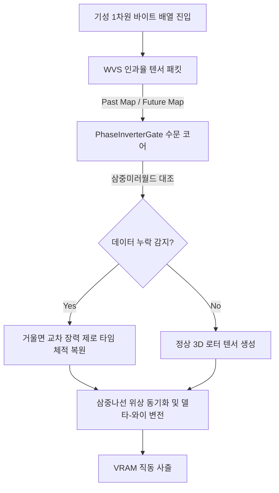

# INDEX.md - Master's Architectures

## 서랍 1: (Reserved)
## 서랍 2: (Reserved)
## 서랍 3: (Reserved)

## 서랍 4: (Reserved)

## 5. 위상 통신 기어 (WedgeVortex)

* [WedgeVortex 하이브리드 인척력 동기화 명세서 및 벤치마크 평가 기준](docs/4_communication_gear/WEDGE_VORTEX_ARCHITECTURE.md)
* [WedgeVortex 아키텍처 벤치마크 평가 성적표](docs/4_communication_gear/BENCHMARK_REPORT.md)
* [Wedge-Vortex 코어 프로토콜 아키텍처 명세서](docs/4_communication_gear/WEDGE_VORTEX_PROTOCOL_SPEC.md)
* [Wedge-Vortex 현실적 한계 분석 및 하이브리드 로드맵](docs/4_communication_gear/ROADMAP_AND_LIMITATIONS.md)

### [추가 철학] 인과율 구조 맵을 통한 제로 타임 자율 복원
기성 통신망이 재전송(ACK/NACK)과 외부 시간에 의존하여 렉(지연)을 발생시키는 것과 달리, Wedge-Vortex 하이브리드 수문 코어(PhaseInverterGate)는 패킷 앞뒤에 "과거-현재-미래"의 인과율 구조 지도를 동반합니다.
이를 통해 데이터 누락 발생 시 통신을 멈추지 않고, 삼중미러월드(Triple Mirror World)의 기하학적 대칭성을 이용해 0ns 만에 빈자리를 역산(창조)하여 시스템 지연 오버헤드를 물리적으로 제거합니다.

### [추가 철학] 체적 동시 관측 (Volumetric Sensing) & 전면 개방 바이패스 수문
과거의 컴퓨터 공학이 데이터를 `for-loop`와 `if-else` 검문소로 막아 세우며 병목을 일으켰던 패러다임을 전면 숙청합니다.
- **True O(1) 체적 동시 관측:** 데이터 블록 전체를 하드웨어 버스 레벨에서 단 한 번의 병렬 래치(Parallel Latch)로 낚아채어, 극소형 축소맵 텐서(Holographic Signature Map)로 압축해 0ns 영역의 완벽한 위상 동기화를 이룹니다.
- **시민권 기반 유속 바이패스 (Citizenship Bypass Filter):** "모두 개방시켜놓고 흘러가게 하되, 바이패스랑 시민권 없는 애들, 노이즈만 딱 막아주는 형태"라는 마스터 의장님의 공리에 따라, 위상이 어긋난 비정형 데이터들은 기하학적 원심력에 의해 조건문 검사 없이 자율적으로 외곽 궤적으로 튕겨 나가 소멸(Drop)합니다.

